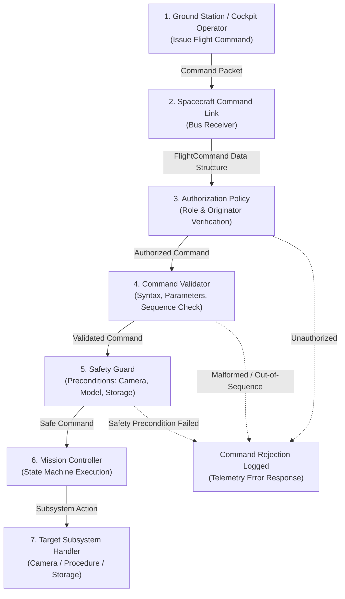

# ASTRA-EA — Flight Command Flow Architecture

### Document ID: `ASTRA-CMD-FLOW-001`
**Milestone**: Phase 18 — Flight Integration Preparation + Onboard Software Packaging  

---

## 1. Architectural Command Ingestion Pipeline

All uplink flight commands pass through five rigorous validation barriers before reaching subsystem execution:

---

## 2. Command Processing Stages

### 2.1 Originator Authorization (`AuthorizationPolicy`)
- Verifies that the originator role (`LOCAL_OPERATOR`, `FLIGHT_CONTROLLER_TBD`, etc.) is permitted to issue the requested `CommandType`.
- Prevents unauthenticated commands from progressing to validation.

### 2.2 Sequence & Replay Defense
- Every command contains a monotonically increasing `sequence_number`.
- Commands with $\text{sequence} \le \text{last\_seen\_sequence}$ are immediately rejected as duplicate or replay attempts.

### 2.3 Safety Interlocks (`CommandSafetyGuard`)
- Before executing critical state-changing commands (such as `START_EXPERIMENT`), the safety guard verifies:
  1. Optical camera is active and producing non-zero frames.
  2. Neural model checkpoint is verified with valid SHA-256 digest.
  3. Procedure YAML specification is loaded and validated.
  4. Flight storage partition has adequate headroom (status $\ne$ `CRITICAL`).

### 2.4 Subsystem Dispatch
- Only after all four gates pass is the command executed by registered subsystem handlers.
- Execution results are packaged into a structured `CommandResponse` containing status (`EXECUTED`), duration, and payload.

---

## 3. Strict Command Decoupling Rule (Section 44)

> [!WARNING]
> Under no circumstances does any UI button or ground tool directly invoke onboard core Python methods.
> 
> All interactions must be encapsulated into serialized `FlightCommand` objects, passed across the command interface, authorized, validated, and logged.
