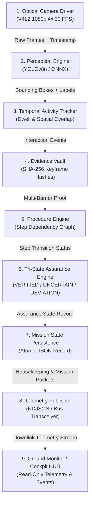

# ASTRA-EA — Flight Data Flow Architecture

### Document ID: `ASTRA-DATA-FLOW-001`
**Milestone**: Phase 18 — Flight Integration Preparation + Onboard Software Packaging  

---

## 1. End-to-End Data Pipeline

The data flow connects raw optical sensor ingestion to ground telemetry downlink through strictly decoupled, bounded stages:

---

## 2. Stage-by-Stage Data Transformations

| Stage | Input Data | Output Data | Latency Budget | Integrity Safeguard |
| :--- | :--- | :--- | :--- | :--- |
| **1. Camera** | CMOS light photons | Raw RGB frame (`numpy.ndarray`) + `FrameTimestamp` | $<5.0$ ms | Frame drop counter; stale frame discard |
| **2. Perception** | $1920 \times 1080$ RGB frame | Detected apparatus bounding boxes + confidence score | $<18.0$ ms | Class whitelist; inference exception trap |
| **3. Activity** | Bounding boxes + hand coordinates | Hand-object contact duration (seconds) | $<2.0$ ms | Dwell filter; spatial proximity threshold |
| **4. Evidence** | Activity dwell confirmed | Crop keyframe + SHA-256 provenance hash | $<5.0$ ms | Cryptographic SHA-256 hashing |
| **5. Procedure** | Evidence verified | Active step increment / prerequisites pass | $<1.0$ ms | Immutable procedure graph schema |
| **6. Assurance** | Step evidence + temporal history | Decision: `VERIFIED`, `UNCERTAIN`, `DEVIATION` | $<2.0$ ms | 5-barrier non-guessing invariant |
| **7. State** | Assurance decision | Atomically persisted JSON mission state | $<4.0$ ms | Atomic temp file rename (`.tmp` $\to$ `.json`) |
| **8. Telemetry** | State + performance metrics | JSON/NDJSON telemetry packet | $<1.0$ ms | Bounded queue; priority pruning |
| **9. Ground** | Serialized telemetry stream | Visual display / operator audio prompt | Transmission TBD | Ground monitor read-only isolation |

---

## 3. Ground Interface Isolation (Section 43)

> [!IMPORTANT]
> The Ground Observability Monitor receives data **strictly over the telemetry and video stream endpoints**.
> 
> Under no circumstances does the ground segment access or mutate onboard Python objects or in-memory state directly.
