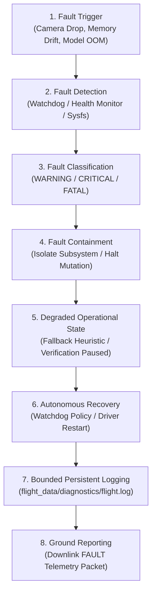

# ASTRA-EA — Flight Fault Flow Architecture

### Document ID: `ASTRA-FAULT-FLOW-001`
**Milestone**: Phase 18 — Flight Integration Preparation + Onboard Software Packaging  

---

## 1. Fault Detection & Mitigation Lifecycle

The flight software incorporates deterministic, closed-loop fault containment designed to prevent single-point failures from halting operational assurance:

---

## 2. Subsystem Anomaly Matrix & Recovery Actions

| Subsystem | Anomaly Scenario | Detection Mechanism | Containment Action | Degraded State | Recovery Action |
| :--- | :--- | :--- | :--- | :--- | :--- |
| **Optical Camera** | Sensor cable unseat or V4L2 device timeout | `consecutive_drops >= 5` in `CameraDriver` | Discard stale frames; suspend frame processing | `PROCEDURE_VERIFICATION_PAUSED` | Re-initialize video capture interface |
| **Neural Inference** | TensorRT / ONNX engine crash | Exception trap in inference wrapper | Engage heuristic spatial fallback detector | `PERCEPTION_DEGRADED` | Reload ONNX graph in safe host memory |
| **Storage Subsystem** | Disk partition $>95\%$ capacity | `StorageManager.get_usage()` threshold | Trigger priority pruning (purge debug / diagnostics) | `STORAGE_WARNING` | Maintain mission events; alert ground |
| **Ground Link** | Loss of downlink communication or network | TCP socket drop or zero ACK response | Continue autonomous onboard verification pipeline | `TELEMETRY_DEGRADED` | Queue telemetry frames in bounded ring buffer |
| **Power Bus** | Brownout dip $<18$V DC | Hardware voltage sensor or brownout interrupt | Atomic flush of active mission state to disk | `POWER_LOSS` | On power restoration, execute `REVIEW_REQUIRED` |
| **Watchdog** | Subsystem thread lock (>3.0s without heartbeat) | Central `Watchdog.check()` deadline | Execute configured `WatchdogPolicy` | `ENTER_DEGRADED` | Subsystem worker process restart |

---

## 3. Post-Anomaly Integrity Guarantee

Following any anomaly containment:
1. Active mission state is preserved in `flight_data/mission/active_mission_state.json`.
2. Verified cryptographic evidence collected prior to the anomaly is never invalidated or deleted.
3. System never blindly resumes an interrupted experiment run without explicit operator review or configured policy.
