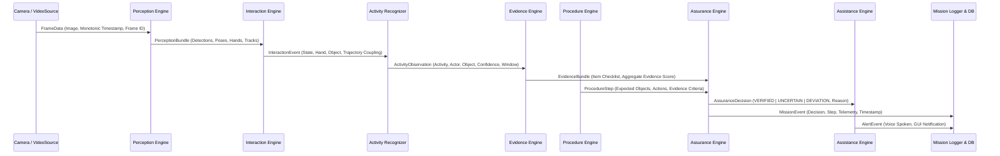

# ASTRA-EA Data Flow & Boundary Specification

## 1. End-to-End Information Pipeline

Data traverses nine discrete boundaries from raw camera photons to mission audit records and human-machine assistance:

---

## 2. Boundary Contracts & Payload Schemas

### Boundary 1: Video Ingestion $\to$ Perception
- **Data Structure**: `FrameData`
- **Fields**:
  - `frame_id`: `int` (Monotonically increasing sequence index)
  - `image`: `numpy.ndarray` (BGR image buffer, shape `(H, W, 3)`)
  - `timestamp_mono`: `float` (Monotonic clock timestamp in seconds for internal delta timing)
  - `timestamp_wall`: `datetime` (UTC wall-clock timestamp for audit logging)
  - `source_id`: `str` (Camera device ID or file path)

### Boundary 2: Perception $\to$ Interaction Understanding
- **Data Structure**: `PerceptionBundle`
- **Fields**:
  - `frame_id`: `int`
  - `timestamp`: `float`
  - `detections`: `List[Detection]` (class_name, confidence, bbox [x1, y1, x2, y2], track_id)
  - `poses`: `List[PoseObservation]` (person_id, keypoints `(x, y, conf)`, orientation_vector)
  - `hands`: `List[HandObservation]` (hand `LEFT | RIGHT`, keypoints, wrist_coordinate)
  - `tracks`: `List[Track]` (track_id, class_name, trajectory_history, velocity)

### Boundary 3: Interaction Understanding $\to$ Activity Recognition
- **Data Structure**: `InteractionEvent`
- **Fields**:
  - `interaction_id`: `str` (UUID)
  - `timestamp`: `float`
  - `hand_type`: `HandType` (`LEFT` | `RIGHT`)
  - `target_object_id`: `str`
  - `target_track_id`: `int`
  - `state`: `InteractionState` (`NONE` | `APPROACHING` | `CONTACT` | `GRASPING` | `HOLDING` | `MOVING` | `RELEASING` | `RELEASED`)
  - `distance`: `float` (Normalized hand-object centroid Euclidean distance)
  - `relative_velocity`: `Tuple[float, float]`
  - `confidence`: `float`

### Boundary 4: Activity Recognition $\to$ Evidence Engine
- **Data Structure**: `ActivityObservation`
- **Fields**:
  - `activity_id`: `str`
  - `activity_name`: `str` (e.g., `APPROACH`, `GRASP`, `LIFT`, `MOVE`, `PLACE`)
  - `actor_id`: `str` (Astronaut identifier)
  - `object_id`: `str` (Experiment object identifier)
  - `confidence`: `float`
  - `window_start`: `float`
  - `window_end`: `float`
  - `duration_seconds`: `float`

### Boundary 5: Evidence Engine $\to$ Assurance Engine
- **Data Structure**: `EvidenceBundle`
- **Fields**:
  - `bundle_id`: `str`
  - `activity_ref`: `str`
  - `timestamp`: `float`
  - `items`: `Dict[str, EvidenceItem]`
    - `object_detected`: `bool` (confidence $\ge$ threshold)
    - `hand_detected`: `bool`
    - `contact_detected`: `bool`
    - `motion_coupled`: `bool`
    - `temporal_consistency`: `bool`
    - `spatial_relation_valid`: `bool`
  - `aggregate_evidence_score`: `float` ($0.0 \le s \le 1.0$)
  - `is_conclusive`: `bool`

### Boundary 6: Assurance Engine $\to$ Assistance & Event Logger
- **Data Structure**: `AssuranceDecision`
- **Fields**:
  - `decision_id`: `str`
  - `experiment_id`: `str`
  - `step_id`: `str`
  - `sequence`: `int`
  - `decision`: `DecisionType` (`VERIFIED` | `UNCERTAIN` | `DEVIATION`)
  - `deviation_reason`: `Optional[DeviationReason]` (`SKIPPED_STEP` | `WRONG_ORDER` | `WRONG_OBJECT` | `INCOMPLETE_ACTION` | `TIMEOUT` | `INSUFFICIENT_EVIDENCE`)
  - `confidence`: `float`
  - `evidence_summary`: `Dict[str, Any]`
  - `timestamp`: `datetime`
  - `recovery_required`: `bool`

### Boundary 7: Assistance Engine $\to$ Operator Outputs
- **Data Structure**: `AssistantMessage`
- **Fields**:
  - `message_id`: `str`
  - `priority`: `AssistantPriority` (`INFO` | `GUIDANCE` | `WARNING` | `CRITICAL`)
  - `text`: `str` (Text for speech synthesizer and GUI banner)
  - `cooldown_seconds`: `float`
  - `spoken`: `bool`
  - `timestamp`: `datetime`
