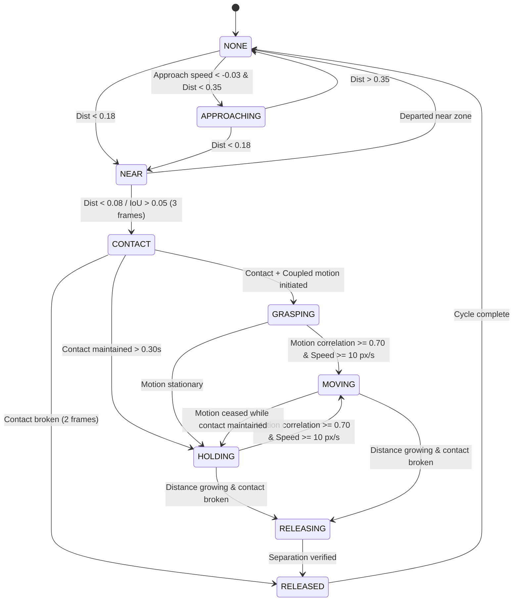

# Physical Interaction Architecture (Phase 3)

## 1. Scope & Objective
The Physical Interaction Subsystem (`core/interaction/`) translates raw perception tracks (`Track`) and hand landmark observations (`HandObservation`) into physical interaction states between astronauts and experiment entities.

This decouples computer-vision detections from activity recognition and procedural assurance, ensuring that spatial kinematics and physical couplings are evaluated deterministically on the edge.

```text
PerceptionState (Tracks, Hands, Poses)
           │
           ▼
Spatial Relationship Engine (Distance, Bearing, Overlap, Relative Velocities)
           │
           ▼
Multi-Signal Interaction Rules (Proximity vs Contact, Coupled vs Independent Motion)
           │
           ▼
Hand-Object State Machine (Hysteresis & Confirmation Frames)
           │
           ▼
InteractionEvent & Telemetry Bus
```

---

## 2. Spatial Relationship Metrics

For every active `(hand_type, track_id)` pair, the system derives:

1. **Pixel Distance:** Euclidean distance between hand center (wrist landmark) and object centroid:
   $$d_{\text{pixel}} = \sqrt{(x_h - x_o)^2 + (y_h - y_o)^2}$$
2. **Normalized Distance:** Scaled by image diagonal to remain camera-resolution invariant:
   $$d_{\text{norm}} = \frac{d_{\text{pixel}}}{\sqrt{W^2 + H^2}}$$
3. **Bounding Box Overlap (IoU):**
   $$\text{IoU} = \frac{\text{Area}(\text{bbox}_h \cap \text{bbox}_o)}{\text{Area}(\text{bbox}_h \cup \text{bbox}_o)}$$
4. **Relative Quadrant Bearing:** Spatial relationship ("INSIDE", "ABOVE", "BELOW", "LEFT", "RIGHT").
5. **Instantaneous Velocities:** First derivative of centroid motion:
   $$\vec{v}_h = \frac{\Delta \vec{p}_h}{\Delta t}, \quad \vec{v}_o = \frac{\Delta \vec{p}_o}{\Delta t}$$
6. **Approach Speed:** Rate of normalized distance change:
   $$v_{\text{approach}} = \frac{d_{\text{curr}} - d_{\text{prev}}}{\Delta t}$$
   *(Negative values represent closing distance; positive represent separation)*.
7. **Motion Correlation (Cosine Similarity):**
   $$\text{corr} = \frac{\vec{v}_h \cdot \vec{v}_o}{\|\vec{v}_h\| \|\vec{v}_o\|} \in [-1.0, 1.0]$$

---

## 3. Interaction State Machine

Each `(hand, track)` pair is tracked by an independent `HandObjectStateMachine`:



---

## 4. Occlusion & Track Loss Resilience

When visual tracking suffers temporary occlusion:
1. `TrackState.TEMPORARILY_LOST`: State machine remains in current state but raises `is_uncertain = True`.
2. Reacquisition: When the track returns to `VISIBLE`, `is_uncertain` is cleared without resetting the interaction timeline.
3. Timeout: If `lost_frames > max_temporary_lost_frames` (default: 15 frames), state cleanly transitions to `NONE`.
