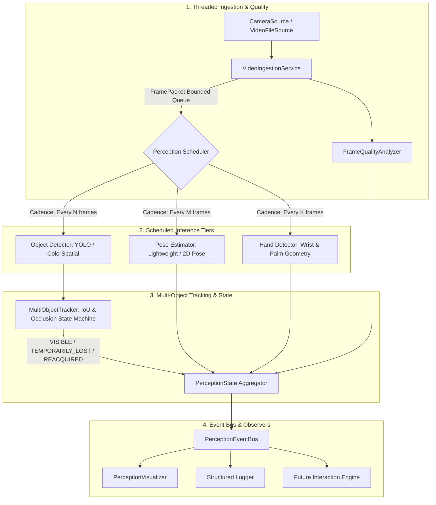

# ASTRA-EA Perception Architecture & Pipeline Design

## 1. Overview
The **ASTRA-EA Perception Subsystem** ingests video frames from onboard cameras, performs optical quality assessments, runs scheduled computer vision models, maintains persistent spatial-temporal tracks, and outputs normalized `PerceptionState` telemetry for downstream interaction and procedure engines.

---

## 2. Subsystem Components

### 2.1 Video Ingestion Service (`core/camera/ingestion.py`)
- **Worker Threading:** Asynchronous background loop decodes frames continuously.
- **Bounded Buffering:** Fixed queue capacity (default: 8 packets) preventing memory leaks.
- **Dropping Policy:** Prefers freshest frames (`drop_oldest`) when downstream processing stalls.
- **Metrics:** Calculates real-time capture FPS and monitors frame-drop rates to update subsystem health (`NORMAL`, `DEGRADED`, `FAILED`).

### 2.2 Device Manager (`core/perception/device.py`)
- Automatically probes host hardware via PyTorch CUDA APIs and system `nvidia-smi`.
- Supports explicit targets (`auto`, `cuda`, `cpu`) with graceful CPU fallback.

### 2.3 Frame Quality Analyzer (`core/perception/quality.py`)
- Measures blur via Laplacian variance ($< 60$ considered blurry).
- Evaluates luminance and contrast metrics to grade frames (`GOOD`, `BLURRY`, `DARK`, `OVEREXPOSED`).

### 2.4 Object Detection Adapters (`core/perception/detection/`)
- **`ObjectDetector` Interface:** Pluggable contract for any visual detection architecture.
- **`YOLOAdapter`:** OpenCV DNN / ONNX model runner supporting exported YOLO weights with non-maximum suppression (NMS) and CUDA target acceleration.
- **`ColorSpatialObjectDetector`:** Real, deterministic computer-vision detector segmenting configured experiment classes (`RED_BOX`, `YELLOW_BOX`, `MAIN_BOX`, `ASTRONAUT`) via HSV color morphology and contour analysis without cloud dependencies.
- **`ModelRegistry`:** Validates model metadata, target tasks, input resolutions, and file existence.

### 2.5 Multi-Object Tracker (`core/perception/tracking/`)
- **IoU Association:** Links detections across temporal frames.
- **Kinematics:** Calculates velocity vectors $(v_x, v_y)$ and maintains 30-frame centroid trajectory histories.
- **Occlusion Lifecycle State Machine:**
  $$\text{VISIBLE} \xrightarrow{\text{detection missing}} \text{TEMPORARILY\_LOST} \xrightarrow{\text{within grace period}} \text{REACQUIRED} \xrightarrow{} \text{VISIBLE}$$
  $$\text{TEMPORARILY\_LOST} \xrightarrow{\text{exceeds max\_lost\_frames}} \text{LOST}$$
- Occluded objects remain in `PerceptionState` with `TEMPORARILY_LOST` flag so downstream assurance engines do not falsely trigger sudden disappearances.

### 2.6 Pose & Hand Estimators (`core/perception/{pose,hands}/`)
- **`LightweightPoseEstimator`:** Orientation-invariant posture analysis tracking nose, shoulders, elbows, wrists, hips, and body tilt angle without assuming Earth-gravity alignment.
- **`LightweightHandDetector`:** Skin-space morphological detector identifying left vs right hands, wrist anchors, palm centroids, and fingertip keypoints.

### 2.7 Perception Scheduler (`core/perception/scheduler.py`)
- Enforces configurable inference intervals (e.g. tracking every frame, detection every frame, pose/hands every $N$ frames) to maintain high throughput on edge hardware.
