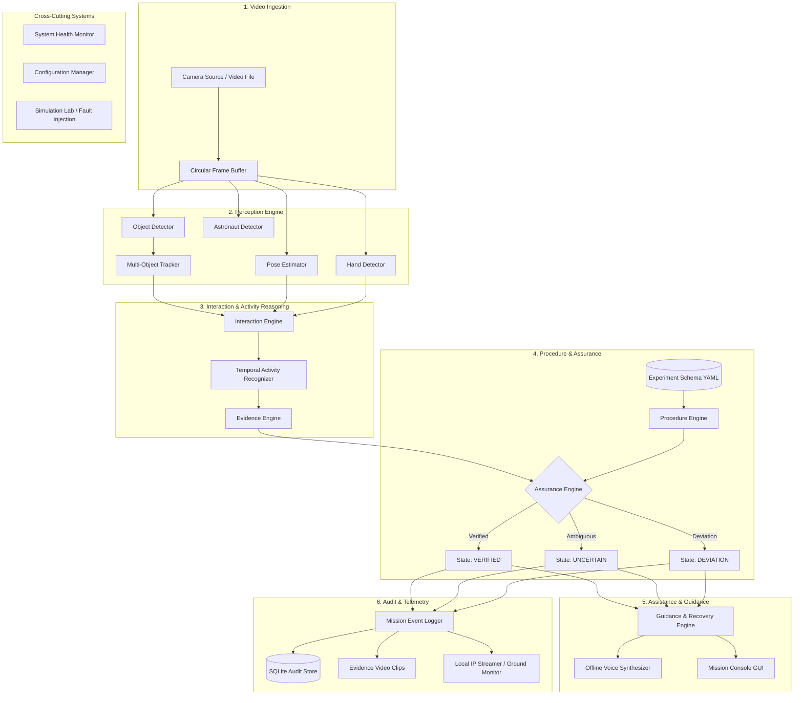

# ASTRA-EA System Architecture

## 1. System Overview

**ASTRA-EA** (Autonomous Spacecraft Experiment Assurance & Assistance) is an offline, edge-AI platform designed to observe astronaut-object interactions, recognize scientific experiment activities, validate procedural sequences, detect deviations, provide voice/visual guidance, and maintain an immutable local audit record.

The foundational design axiom is:
> **AI observes. Evidence explains. The assurance engine decides. The assistance engine communicates. The logger records.**

Raw AI confidence is never treated as mission ground truth. Instead, decisions are grounded in explainable, multi-factor evidence bundles.

---

## 2. Architectural Tiers

### 2.1 Video Ingestion Tier
- **Abstraction**: `CameraSource` interface decoupling hardware capture from processing.
- **Implementations**:
  - `WebcamSource`: Real-time capture from USB/MIPI/CSI cameras via OpenCV.
  - `VideoFileSource`: Deterministic playback for regression testing, simulation, and post-flight analysis.
- **Frame Buffer**: High-throughput circular queue holding temporal windows (5–30 seconds) for activity reasoning and pre/post-incident evidence clipping.

### 2.2 Perception Engine
- **Object Detector**: Identifies bounding boxes, classes, and confidences for experiment objects.
- **Astronaut Detector & Pose Estimator**: Tracks torso, arms, and orientation invariant to spacecraft gravity vectors (e.g., floating, sideways, inverted).
- **Hand Detector**: Extracts 2D/3D wrist and finger keypoints.
- **Multi-Object Tracker**: Maintains persistent `track_id` assignments across brief occlusions with Kalman filters and spatial-temporal association.

### 2.3 Interaction & Activity Reasoning Tier
- **Interaction Engine**: Models spatial-temporal relationships between astronaut hands and tracked objects:
  $$\text{Distance} \to \text{Trajectory Coupling} \to \text{Contact} \to \text{Grasp} \to \text{Motion}$$
- **Temporal Activity Recognizer**: Aggregates interaction state sequences across sliding temporal windows (avoiding naive single-frame classification).
- **Evidence Engine**: Formulates explainable `EvidenceBundle` instances containing Boolean and scored criteria:
  - Object visibility & confidence
  - Hand presence & keypoint fidelity
  - Physical contact & relative velocity coupling
  - Temporal consistency & duration thresholds

### 2.4 Procedure & Assurance Tier
- **Procedure Engine**: Dynamic state machine parameterized by external experiment schema (YAML/JSON). Tracks current step, expected objects, expected actions, timeouts, and permissible step transitions.
- **Assurance Engine**: Deterministic decision evaluator yielding three immutable states:
  - **`VERIFIED`**: Activity matches expected step; all required evidence conditions met.
  - **`UNCERTAIN`**: Visual ambiguity, occlusion, low confidence, or missing hand/object. **Never classified as DEVIATION.**
  - **`DEVIATION`**: Active contradiction detected (e.g., `SKIPPED_STEP`, `WRONG_ORDER`, `WRONG_OBJECT`, `TIMEOUT`).

### 2.5 Assistance & Recovery Tier
- **Guidance Engine**: Emits contextual voice/visual prompts for standard step progression.
- **Recovery Engine**: Executes closed-loop recovery protocol:
  $$\text{Detect} \longrightarrow \text{Explain} \longrightarrow \text{Recommend} \longrightarrow \text{Observe} \longrightarrow \text{Verify} \longrightarrow \text{Resume}$$
- **Offline Voice Engine**: Local text-to-speech with priority queuing, deduplication, and cooldowns to prevent cognitive overload.

### 2.6 Storage & Ground Telemetry
- **SQLite Database**: Structured metadata, audit trails, state transitions, and health heartbeats.
- **Evidence Vault**: Pre/post-event video clips corresponding to critical deviations and milestone verifications.
- **Ground Monitor**: Pluggable local stream (RTSP/WebRTC) enabling remote oversight without requiring continuous bi-directional cloud control.

---

## 3. Cross-Cutting Systems

1. **System Health Monitor**: Continually samples camera FPS, inference latency, memory pressure, storage utilization, and subsystem states (`NORMAL`, `DEGRADED`, `FAILED`, `RECOVERING`).
2. **Configuration Subsystem**: Centralized, schema-validated parameters for all thresholds, timeouts, and device mappings.
3. **Simulation Lab & Fault Injection**: Injects synthetic dropouts, occlusions, wrong objects, and skipped steps to validate assurance robustness deterministically.
