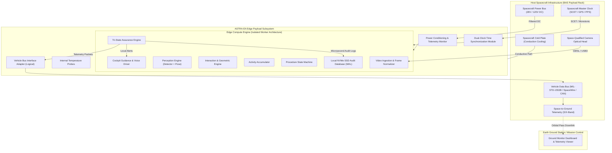

# ASTRA-EA: Spacecraft Integration Architecture & System Context

**Document Classification:** Aerospace Payload Architecture & Interface Specification  
**System:** Autonomous Spacecraft Experiment Assurance & Assistance (ASTRA-EA)  
**Milestone:** Phase 15 — Qualification Readiness

---

## 1. Executive Summary & Integration Principle

ASTRA-EA is architected as an autonomous edge payload subsystem for scientific laboratory experiment monitoring aboard the **Bharatiya Antariksh Station (BAS)** or modular exploration spacecraft.

To ensure qualification readiness without binding the software to proprietary spacecraft hardware before official vehicle specifications are finalized, the architecture enforces a strict architectural boundary:

```
[ ASTRA-EA INTERNAL APPLICATION CORE ]  <==== EXPLICIT LOGICAL BOUNDARY ====>  [ HOST SPACECRAFT BUS SERVICES ]
  - Neural Optical Perception (Detector + Pose)                                 - Primary Unregulated / Regulated Power Bus
  - Spatial Interaction & Contact Estimator                                      - Structural Conduction / Thermal Management
  - Temporal Activity Accumulator                                                - Spacecraft Master Clock / SCET Time Source
  - Deterministic Procedure State Machine                                        - Onboard Telemetry & Command Data Bus
  - Epistemic Assurance Engine (Tri-State)                                       - SpaceWire / GMSL Optical Camera Sensor Links
  - Local Cockpit Voice & Visual Guidance                                        - Spacecraft Long-Range S/X/Ka-Band Ground Link
  - Tamper-Evident Local SQLite Audit Store
```

---

## 2. System Context Diagram



---

## 3. Subsystem Boundary Partitioning

| Subsystem Domain | Execution Environment | Criticality Tier | Failure Impact on Spacecraft |
| :--- | :--- | :---: | :--- |
| **Assurance Core** | Edge Worker (Isolated Memory) | **CRITICAL** | None (Confined to payload experiment verification) |
| **Perception Engine** | GPU / NPU Accelerator Worker | **CRITICAL** | None (Fails over to baseline heuristic without crash) |
| **Local Storage** | Local NVMe SSD Partition | **IMPORTANT** | None (Write-Ahead Logging prevents filesystem corruption) |
| **Cockpit Audio Guidance** | Local Audio DAC / Speaker | **OPTIONAL** | None (Muted audio auto-switches to visual HUD banners) |
| **Ground Streaming** | WebSocket / MJPEG Server | **AUXILIARY** | Zero (Severed ground link leaves onboard assurance active) |

---

## 4. Operational Invariant: Air-Gap Autonomy

The fundamental spacecraft integration rule for ASTRA-EA:
> **The onboard procedural assurance engine, neural detector, temporal activity parser, and local audit storage SHALL NOT require external network connectivity, ground communication passes, or cloud infrastructure to execute, verify, or recover an experiment.**
